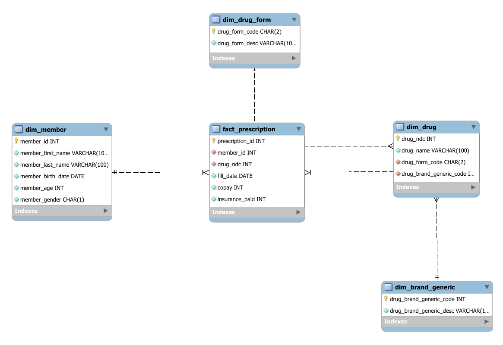

# Pharmacy Claims Data Warehouse — Star Schema (SQL)

A dimensional data warehouse for pharmacy benefit-manager (PBM) prescription
claims, built in **MySQL**. Raw denormalized claims data is normalized to
**Third Normal Form (3NF)**, modeled as a **star schema** (1 fact + 4
dimensions), loaded, constrained with referential integrity, and queried for
business insights using **CASE logic** and **window functions**.

> Originally developed for a graduate Data Warehousing & SQL course and
> repackaged here with relative load paths, split scripts, a data dictionary,
> and a data-quality test suite.

---

## Skills demonstrated
- **Dimensional modeling** — star schema design, fact grain definition, additive measure classification
- **Normalization** — 1NF → 3NF, removing repeating groups and transitive dependencies
- **SQL (MySQL 8)** — DDL, constraints, `LOAD DATA`, multi-table joins, `CASE`, CTEs, `ROW_NUMBER()` / `LEAD()` window functions
- **Referential integrity** — deliberate `ON DELETE` / `ON UPDATE` rule selection per relationship
- **Data quality** — validation / reconciliation test suite (orphan, range, duplicate, age-consistency checks)

---

## Schema



| Table | Type | Grain / Purpose |
|---|---|---|
| `fact_prescription` | Fact | One row per prescription **fill event** |
| `dim_member` | Dimension | Patient demographics |
| `dim_drug` | Dimension | Drug attributes (NDC, name) |
| `dim_drug_form` | Dimension | Administration form (Tablet, Oral Solution, …) |
| `dim_brand_generic` | Dimension | Brand vs. generic classification |

Full column-level detail: [`docs/data_dictionary.md`](docs/data_dictionary.md).

---

## Repo structure
```
pharmacy-claims-star-schema/
├── sql/
│   ├── 01_schema_and_load.sql      # DDL, CSV load, primary & foreign keys
│   ├── 02_analytics_queries.sql    # 3 business questions
│   └── 03_data_quality_checks.sql  # validation / reconciliation suite
├── data/                           # source CSVs (3NF tables)
├── docs/
│   ├── erd.png                     # entity relationship diagram
│   ├── erd.pdf
│   └── data_dictionary.md
└── README.md
```

---

## How to run

```bash
# 1. Clone
git clone https://github.com/<your-username>/pharmacy-claims-star-schema.git
cd pharmacy-claims-star-schema

# 2. Start MySQL with local-infile enabled (needed for LOAD DATA LOCAL)
mysql --local-infile=1 -u root -p
```
```sql
-- 3. Inside the MySQL client
SET GLOBAL local_infile = 1;
SOURCE sql/01_schema_and_load.sql;     -- build + load (run from repo root)
SOURCE sql/02_analytics_queries.sql;   -- analytics
SOURCE sql/03_data_quality_checks.sql; -- validation (healthy = 0 rows)
```
> If `LOAD DATA` can't find the CSVs, edit the path prefix in
> `01_schema_and_load.sql` to the absolute path where you cloned the repo.

---

## Analytics highlights

**Q1 — Volume by drug.** Counts fills per drug to surface the most-prescribed
medications.

**Q2 — Cost by age band.** Uses a `CASE` statement to split members into 65+ vs.
under-65 and compares prescription volume, unique members, total copay, and
total plan spend.

**Q3 — Most recent fill per member.** A CTE with `ROW_NUMBER()` isolates each
member's latest fill, while `LEAD()` exposes the prior fill for trend comparison.

---

## Design decisions worth calling out
- **Surrogate key on the fact table** — no natural column uniquely identifies a
  fill event (a member can refill the same drug), so a surrogate `prescription_id`
  is cleaner than a bulky composite key.
- **Mixed FK rules by intent** — fills cascade-delete with their member, but a
  drug with fill history is delete-`RESTRICT`ed to preserve audit/compliance
  records.
- **Both measures are additive** — `copay` and `insurance_paid` sum meaningfully
  across every dimension.

---

## Tech
MySQL 8.x · dimensional modeling · ANSI SQL window functions

## Author
**Sunil Thirumani** — Data / Analytics Engineer (Greater Toronto Area)
